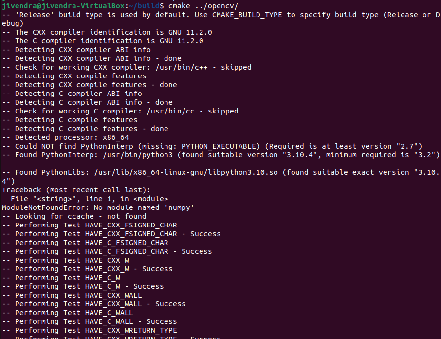

Informasi lebih lengkap dapat mengakses pada laman [berikut](https://opencv.org/).

# <a id = "pengenalan-opencv">Pengenalan OpenCV</a>

<p style="text-align: justify;">
OpenCV adalah sebuah library yang digunakan untuk mengolah gambar dan video. Kata open pada OpenCV dimaksudkan opensource gratis, tidak berbayar, bisa didownload dimana saja. Sementara CV pada kata OpenCV adalah kependekan dari Computer Vision, digunakan untuk mengolah image (citra/gambar) yang ditangkap oleh alat perekam seperti kamera atau webcam yang dikonversi dari analog ke digital lalu diolah dalam komputer. Pemrosesan gambar  memiliki banyak tujuan dalam pengolahan image ini ada banyak, diantaranya untuk memperbaiki kualitas gambar atau untuk identifikasi gambar.</p>

# <a id = "daftar-isi">Daftar Isi</a>
- [Pengenalan OpenCV](#pengenalan-opencv)
- [Daftar Isi](#daftar-isi)
- [Instalasi OpenCV](#instalasi-opencv)
   + [Instalasi OpenCV Python]()
   + [Instalasi OpenCV C++]()
- [Tutorial](#tutorial)
   + [Read, Display, dan Write Gambar](#read-display-write)
   + [Read Video](#read-video)
   + [Resize dan Cropping Frame](#resize-cropping)
   + [Color Spaces](#color-spaces)
# <a id = "instalasi-opencv">Instalasi OpenCV</a>

#### <a id = "instalasi-opencv-python">Instalasi OpenCV Python</a>

Buka terminal pada direktori root, lalu masukkan command di bawah.

```bash
sudo apt-get install python3-opencv
```

#### <a id = "instalasi-opencv-c++">Instalasi OpenCV C++</a>

Buka terminal pada direktori root, lalu masukkan command di bawah.

1. Install package dan tools yang dibutuhkan

```bash
sudo apt install -y g++ cmake make git libgtk2.0-dev pkg-config
```

2. Download sumbernya\
   Clone OpenCV versi terbaru pada github.
   

```bash
git clone https://github.com/opencv/opencv.git
```

3. Build sumbernya\  
   Buat folder build dan masuk ke dalam direktori tersebut.

```bash
mkdir -p build && cd build
```

Generate script buildnya dengan menggunakan cmake.

```bash
cmake ../opencv
```


Lalu build sumbernya dengan make.

```bash
make -j4
```

 4. Install OpenCV package

```bash
sudo make install
```


Apabila tidak terdapat error sama sekali, maka instalasi OpenCV telah berhasil. Header file terdapat pada direktori

```
/usr/local/include/opencv4
```

# <a id = "tutorial">Tutorial</a>

#### <a id = "read-display-write">Read, Display, dan Write Gambar</a>

##### Read

Digunakan untuk membaca sebuah gambar, gunakan fungsi imread().

```C++
imread(filename, flags)
```

Terdapat 2 argumen pada fungsinya:

1. Argumen pertama merupakan pathname dari file gambar.
2. Opsional argumen untuk menspesifikkan bagaimana sebuah gambar direpresentasikan.

##### Display

Untuk menampilkan sebuah gambar, gunakan fungsi imshow().

```C++
imshow(window_name, image)
```

Terdapat 2 argumen pada fungsinya:

1. Argumen pertama merupakan nama window yang akan ditampilkan.
2. Argumen kedua merupakan file gambar yang ingin ditampilkan.

##### Write

Digunakan untuk menyimpan file ke dalam direktori tertentu, gunakan fungsi imwrite().

```C++
imwrite(filename, image).
```

Terdapat 2 argumen pada fungsinya:

1. Argumen pertama merupakan nama file yang akan disave (perlu memberikan ekstensi seperti .png, .jpg).
2. Argumen kedua merupakan file gambar yang ingin disave.\

Berikut merupakan contoh penggunaannya:

```C++
//Include Libraries
#include<opencv2/opencv.hpp>
#include<iostream>

// Namespace nullifies the use of cv::function();
using namespace std;
using namespace cv;

// Read an image
Mat img_grayscale = imread("test.jpg", 0);

// Display the image.
imshow("grayscale image", img_grayscale);

// Wait for a keystroke.
waitKey(0);

// Destroys all the windows created
destroyAllWindows();

// Write the image in the same directory
imwrite("grayscale.jpg", img_grayscale);
```

<div style="text-align: center;">
<br>
Gambar awal <br>
<br>
Hasil Gambar GrayScale<br>
</div>

#### <a id = "read-video">Read Video</a>

<p style="text-align: justify;">
Sedikit berbeda dengan read pada gambar, read pada video menggunakan fungsi sebagai berikut.
</p>

```C++
VideoCapture vid_capture("Resources/Cars.mp4");
```

<p style="text-align: justify; font-size:11px;">
Selain mengambil capture dari sebuah file, dapat juga mengambil video menggunakan webcam dengan memberikan argumen index kamera yang ingin digunakan. Secara default, indexnya adalah 0.
</p>

```C++
VideoCapture vid_capture(0);
```

Contoh full programnya:

```C++
// Include Libraries
#include<opencv2/opencv.hpp>
#include<iostream>

// Namespace to nullify use of cv::function(); syntax
using namespace std;
using namespace cv;

int main()
{
  // initialize a video capture object
  VideoCapture vid_capture("Resources/Cars.mp4");

  // Print error message if the stream is invalid
  if (!vid_capture.isOpened())
  {
    cout << "Error opening video stream or file" << endl;
  }

  else
  {
    // Obtain fps and frame count by get() method and print
    // You can replace 5 with CAP_PROP_FPS as well, they are enumerations
    int fps = vid_capture.get(5);
    cout << "Frames per second :" << fps;

    // Obtain frame_count using opencv built in frame count reading method
    // You can replace 7 with CAP_PROP_FRAME_COUNT as well, they are enumerations
    int frame_count = vid_capture.get(7);
    cout << "  Frame count :" << frame_count;
  }


  // Read the frames to the last frame
  while (vid_capture.isOpened())
  {
    // Initialise frame matrix
    Mat frame;

      // Initialize a boolean to check if frames are there or not
    bool isSuccess = vid_capture.read(frame);

    // If frames are present, show it
    if(isSuccess == true)
    {
      //display frames
      imshow("Frame", frame);
    }

    // If frames are not there, close it
    if (isSuccess == false)
    {
      cout << "Video camera is disconnected" << endl;
      break;
    }

    //wait 20 ms between successive frames and break the loop if key q is pressed
    int key = waitKey(20);
    if (key == 'q')
    {
      cout << "q key is pressed by the user. Stopping the video" << endl;
      break;
    }


  }
  // Release the video capture object
  vid_capture.release();
  destroyAllWindows();
  return 0;
}
```

#### <a id = "resize-cropping">Resize dan Cropping Frame</a>

Dalam C++, untuk mendapatkan size dari sebuah frame:

- image.rows: tinggi
- image.cols: lebar

##### Resize

Untuk mengubah size frame dapat menggunakan fungsi resize().

```
resize(src, output, size, interpolation)
```

- src: input image/video (contoh: tes.jgp)
- dsize: output image/video
- size: ukuran yang diingkan
- interpolation: opsi metode dalam resizing gambar

Contoh program resizing:

```C++
// let's start with including libraries
#include<opencv2/opencv.hpp>
#include<iostream>

// Namespace to nullify use of cv::function(); syntax
using namespace std;
using namespace cv;

int main()
{
  // Read the image using imread function
  Mat image = imread("image.jpg");
  imshow("Original Image", image);


  // let's downscale the image using new  width and height
  int down_width = 300;
  int down_height = 200;
  Mat resized_down;
  //resize down
  resize(image, resized_down, Size(down_width, down_height), INTER_LINEAR);
  // let's upscale the image using new  width and height
  int up_width = 600;
  int up_height = 400;
  Mat resized_up;
  //resize up
  resize(image, resized_up, Size(up_width, up_height), INTER_LINEAR);
  // Display Images and press any key to continue
  imshow("Resized Down by defining height and width", resized_down);
  waitKey();
  imshow("Resized Up image by defining height and width", resized_up);
  waitKey();


  destroyAllWindows();
  return 0;
}
```

Selain menggunakan ukuran pasti, resizing juga dapat dilakukan dengan menggunakan skala.

```C++
// Scaling Up the image 1.2 times by specifying both scaling factors
double scale_up_x = 1.2;
double scale_up_y = 1.2;
// Scaling Down the image 0.6 times specifying a single scale factor.
double scale_down = 0.6;
Mat scaled_f_up, scaled_f_down;
//resize
resize(image,scaled_f_down, Size(), scale_down, scale_down, INTER_LINEAR);
resize(image, scaled_f_up, Size(), scale_up_x, scale_up_y, INTER_LINEAR);
```

##### Cropping

Berikut merupakan syntax untuk memotong sebuah gambar/video.

```C++
img(Range(start_row, end_row), Range(start_col, end_col))
```

Contoh:

```C++
// Include Libraries
#include<opencv2/opencv.hpp>
#include<iostream>

// Namespace nullifies the use of cv::function();
using namespace std;
using namespace cv;

int main()
{
  // Read image
  Mat img = imread("test.jpg");
  cout << "Width : " << img.size().width << endl;
  cout << "Height: " << img.size().height << endl;
  cout<<"Channels: :"<< img.channels() << endl;
  // Crop image
  Mat cropped_image = img(Range(80,280), Range(150,330));

  //display image
  imshow(" Original Image", img);
  imshow("Cropped Image", cropped_image);

  //Save the cropped Image
  imwrite("Cropped Image.jpg", cropped_image);

  // 0 means loop infinitely
  waitKey(0);
  destroyAllWindows();
  return 0;
}
```

<div style="text-align: center; font-size: 11px">
<br>
Gambar awal <br>
<br>
Hasil Gambar Cropped<br>
</div>

#### <a id = "color-spaces">Color Spaces</a>

Ada macam-macam color spaces, yakni:

- RGB
  <div style="text-align: center; font-size: 11px">
  <br>
  </div>

  1.  R (Red)
  2.  G (Green)
  3.  B (Blue)

- LAB
  <div style="text-align: center; font-size: 11px">
  <br>
  </div>

  1.  L (Lightness)
  2.  a (color component ranging from Green to Magenta)
  3.  b (color component ranging from Blue to Yellow)

- YCrCb
  <div style="text-align: center; font-size: 11px">
  <br>
  </div>

  1.  Y (Luminance)
  2.  Cr = R - Y (Seberapa jauh komponen merah dengan luma)
  3.  Cb = B - Y (Seberapa jauh komponen biru dengan luma)

- HSV
  <div style="text-align: center; font-size: 11px">
  <br>
  </div>

  1.  H (Hue)
  2.  S (Saturation)
  3.  V (Value)

Untuk mengubah sebuah frame sesuai dengan color space yang diingkan, dapat menggunakan fungsi cvtColor().

```
cvtColor(inputFile, outputFile, colorSpace)
```

Color space yang biasa digunakan untuk objek deteksi adalah HSV. Berikut merupakan contoh program deteksi warna menggunakan HSV.

```C++
//C++ code
cv::Vec3b bgrPixel(40, 158, 16);
// Create Mat object from vector since cvtColor accepts a Mat object
Mat3b bgr (bgrPixel);

//Convert pixel values to other color spaces.
Mat3b hsv;
cvtColor(bgr, hsv, COLOR_BGR2HSV);
//Get back the vector from Mat
Vec3b hsvPixel(hsv.at<Vec3b>(0,0));

int thresh = 40;

cv::Scalar minHSV = cv::Scalar(hsvPixel.val[0] - thresh, hsvPixel.val[1] - thresh, hsvPixel.val[2] - thresh)
cv::Scalar maxHSV = cv::Scalar(hsvPixel.val[0] + thresh, hsvPixel.val[1] + thresh, hsvPixel.val[2] + thresh)

cv::Mat maskHSV, resultHSV;
cv::inRange(brightHSV, minHSV, maxHSV, maskHSV);
cv::bitwise_and(brightHSV, brightHSV, resultHSV, maskHSV);

cv2::imshow("Result HSV", resultHSV)
```
Parameter masing-masing fungsi:
```
inRange(inputFrame, lowerboundary, upperboundary, outputFrame) 	
```
```
bitwise_and(inputFrame1, inputFrame2, outputFrame, maskFrame) 	
```