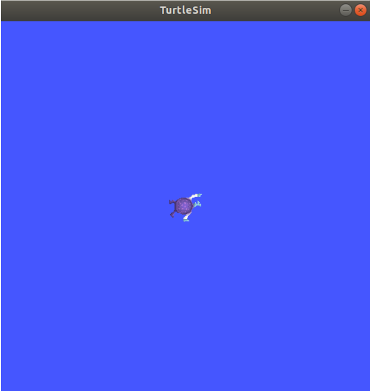
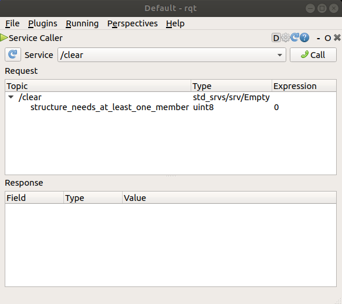

#Pengenalan ROS
Dalam era teknologi yang semakin maju, robot interaktif menjadi salah satu bidang yang semakin diminati dalam dunia pendidikan. Dalam rangka menghadapi perkembangan ini, Robot Operating System (ROS) dan Gazebo muncul sebagai media pembelajaran yang inovatif dan efektif dalam mengembangkan keterampilan robotika. Artikel ini akan membahas tentang penggunaan ROS dan Gazebo sebagai media pembelajaran robot interaktif.

- Pengenalan Robot Operating System (ROS): Robot Operating System (ROS) adalah kerangka kerja perangkat lunak yang dirancang khusus untuk mengembangkan aplikasi robotika. ROS menyediakan berbagai fungsi dan alat yang memungkinkan pengembang untuk mengendalikan robot dengan mudah. Dengan menggunakan ROS, pengguna dapat menghubungkan, mengontrol, dan mengintegrasikan komponen robot secara efisien.

- Manfaat ROS dalam Pembelajaran Robot Interaktif: ROS menawarkan sejumlah manfaat bagi pembelajaran robot interaktif, antara lain: a. Modularitas: ROS memungkinkan pengguna untuk mengembangkan dan menguji modul-modul robot secara terpisah sebelum mengintegrasikannya. Hal ini memudahkan proses pembelajaran dan eksperimen dengan komponen robotik yang berbeda. b. Komunitas yang Aktif: ROS memiliki komunitas yang luas dan aktif, yang memungkinkan pengguna untuk berbagi pengetahuan, pengalaman, dan kode sumber. Ini menciptakan lingkungan kolaboratif yang mendorong pembelajaran dan inovasi. c. Simulasi: ROS menyediakan fasilitas simulasi yang kuat melalui Gazebo. Dengan simulasi ini, pengguna dapat menguji robot dan kode programnya tanpa memerlukan perangkat keras fisik. Hal ini memungkinkan eksperimen yang aman, efisien, dan berulang-ulang.

## Daftar Isi

- [Instalasi ROS Humble](#instalasi-ROS)
  - [Instalasi ROS Humble dan konfigurasi](#instalasi-ROS)
  - [Demo](#demo)
- [Tutorials](#tutorials)
  - [Memakai turtlesim, ros2, dan rqt](#Memakai-turtlesim,-ros2,-dan-rqt)

# Instalasi ROS Humble

## Set locale

```
locale  # check for UTF-8

sudo apt update && sudo apt install locales
sudo locale-gen en_US en_US.UTF-8
sudo update-locale LC_ALL=en_US.UTF-8 LANG=en_US.UTF-8
export LANG=en_US.UTF-8

locale  # verify settings
```

## Setup Resources

Kamu perlu menambahkan ROS 2 apt repository ke sistemmu. :)

pertama pastikan repository ubuntu universe sudah aktif.

```
sudo apt install software-properties-common
sudo add-apt-repository universe
```

Lalu tambahkan ROS 2 GPG key dengan menggunakan apt.

```
sudo apt update && sudo apt install curl -y
sudo curl -sSL https://raw.githubusercontent.com/ros/rosdistro/master/ros.key -o /usr/share/keyrings/ros-archive-keyring.gpg
```

Lalu tambahkan repository itu ke source list anda. :")

```echo "deb [arch=$(dpkg --print-architecture) signed-by=/usr/share/keyrings/ros-archive-keyring.gpg] http://packages.ros.org/ros2/ubuntu $(. /etc/os-release && echo $UBUNTU_CODENAME) main" | sudo tee /etc/apt/sources.list.d/ros2.list > /dev/null

```

## Install ROS 2 Packages

Update dulu ya gaes.

```
sudo apt update
```

Habis update kita implementarsikan updatenya dengan menggunakan command. :v

```
sudo apt upgrade
```

Lalu kita install ROS 2 Humble nyaa

```
sudo apt install ros-humble-desktop
```

tunggu sampai selesai, pada saat terms tinggal enter enter trus sampai ditanya y/n lalu jawab y

##Environment setup
Untuk mengsetup environment kita perlu mengubah bashrc kita

```
gedit ~/.bashrc
```

lalu scroll sampai bawah, jika sudah sampai bawah buat line baru lalu tambahkan

```
source /opt/ros/humble/setup.bash
```

lalu save dan exit gedit. Setelah itu restart terminal kalian. :(

Selanjutnya coba jalankan command ini untuk mengecek apakah sudah sukses disourcing dan apakah versi ros sudah sesuai

```
printenv | grep -i ROS
```

jikalau output menunjukkan

```
ROS_VERSION=2
ROS_PYTHON_VERSION=3
ROS_DISTRO=humble
```

Maka sudahh benarr yeayy :o

# Demo

Setelah kamu install ROS 2 Humble silakan coba demo talker dan listener ini.

pada 1 terminal jalankan kode c++ ini

```
source /opt/ros/humble/setup.bash
ros2 run demo_nodes_cpp talker
```

Lalu pada terminal ke-2 jalankan kode python ini

```
source /opt/ros/humble/setup.bash
ros2 run demo_nodes_py listener
```

Lalu amati apa yang terjadi. Jika si talker bilang sudah publish dan si listener sudah bilang "i heard" berarti API c++ dan python sudah bekerja dengan benarr yeayy :)

# Tutorials

## Memakai turtlesim, ros2, dan rqt

### Pengenalan

Turtlesim adalah simulator ringan untuk mempelajari ROS 2. Ini mengilustrasikan apa yang dilakukan ROS 2 pada tingkat paling dasar untuk memberi Anda gambaran tentang apa yang akan Anda lakukan dengan robot sungguhan atau simulasi robot nantinya.

Alat ros2 adalah cara pengguna mengelola, mengintrospeksi, dan berinteraksi dengan sistem ROS. Alat ini mendukung banyak perintah yang menargetkan berbagai aspek sistem dan operasinya. Seseorang dapat menggunakannya untuk memulai sebuah node, mengatur parameter, mendengarkan sebuah topik, dan masih banyak lagi. Alat ros2 adalah bagian dari instalasi inti ROS 2.

rqt adalah alat antarmuka pengguna grafis (GUI) untuk ROS 2. Semua yang dilakukan dalam rqt dapat dilakukan pada baris perintah, tetapi rqt menyediakan cara yang lebih mudah digunakan untuk memanipulasi elemen-elemen ROS 2.

Tutorial ini membahas konsep-konsep inti ROS 2, seperti node, topik, dan layanan. Semua konsep ini akan diuraikan dalam tutorial selanjutnya; untuk saat ini, Anda hanya akan menyiapkan alat dan merasakannya.

### Install turtlesim

Pertama-tama kita install turtlesim

```
sudo apt update

sudo apt install ros-humble-turtlesim
```

Lalu cek package nya

```
ros2 pkg executables turtlesim
```

command diatas harusnya mengoutputkan

```
turtlesim draw_square
turtlesim mimic
turtlesim turtle_teleop_key
turtlesim turtlesim_node
```

### Jalankan turtlesim

Jalankan command dibawah ini

```
ros2 run turtlesim turtlesim_node
```

window simulator akan muncul seperti gambar dibawah



Lalu pada terminal akan muncul output seperti ini

```
[INFO] [turtlesim]: Starting turtlesim with node name /turtlesim
[INFO] [turtlesim]: Spawning turtle [turtle1] at x=[5.544445], y=[5.544445], theta=[0.000000]
```

Di sana Anda bisa melihat nama default penyu dan koordinat tempat penyu tersebut muncul.

### Memakai turtlesim

Buka terminal baru lagi, lalu masukkan command ini

```
ros2 run turtlesim turtle_teleop_key
```

Command ini untuk menjalankan node baru yang akan kita gunakan untuk mengendalikan penyu di node pertama.

Pada titik ini, Anda seharusnya memiliki tiga jendela yang terbuka: terminal yang menjalankan turtlesim_node, terminal yang menjalankan turtle_teleop_key, dan jendela turtlesim. Aturlah jendela-jendela ini agar Anda dapat melihat jendela turtlesim, tetapi juga membuat terminal yang menjalankan turtle_teleop_key aktif agar Anda dapat mengontrol kura-kura di turtlesim.

Gunakan tombol panah pada keyboard Anda untuk mengontrol kura-kura. Kura-kura akan bergerak di sekitar layar, menggunakan "pena" yang terpasang untuk menggambar jalur yang telah dilaluinya sejauh ini.

Catatan

Menekan tombol panah hanya akan menyebabkan kura-kura bergerak dalam jarak pendek dan kemudian berhenti. Hal ini karena, secara realistis, Anda tidak ingin robot terus melanjutkan instruksi jika, misalnya, operator kehilangan koneksi ke robot.

Anda dapat melihat node, dan topik, services, dan actions, dengan menggunakan subperintah list dari masing-masing command:

```
ros2 node list
ros2 topic list
ros2 service list
ros2 action list
```

### Install rqt

Buka terminal baru untuk menginstall rqt

```
sudo apt update

sudo apt install ~nros-humble-rqt*
```

Untuk menjalankan rqt:

```
rqt
```

### Memakai rqt

Saat menjalankan rqt untuk pertama kali mungkin windownya akan blank. tinggal select Plugins > Services > Service Caller dari menu bar diatas



Kalian bisa lihat lihat service disana
