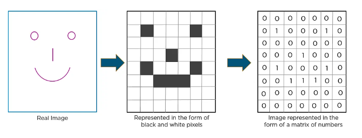
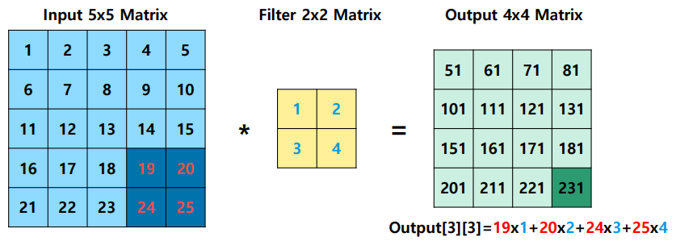
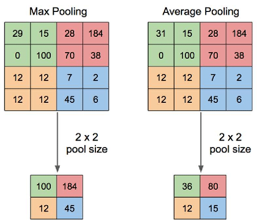
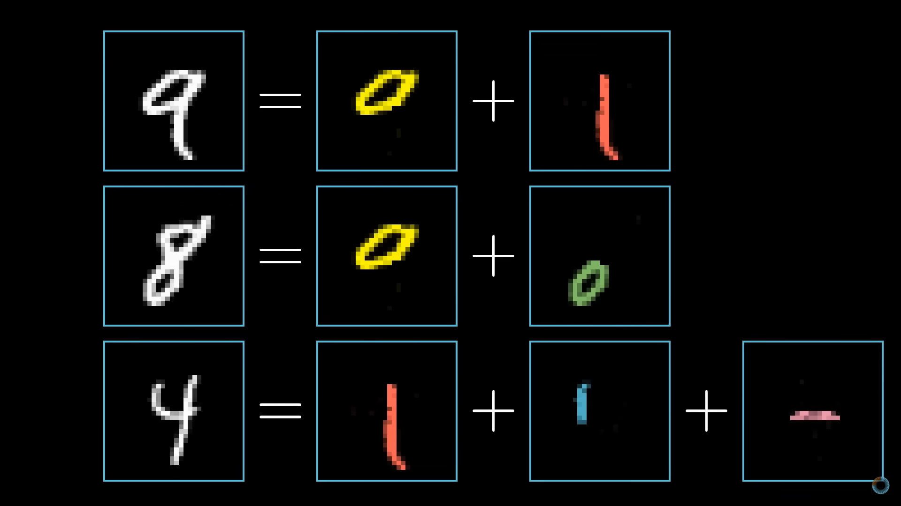
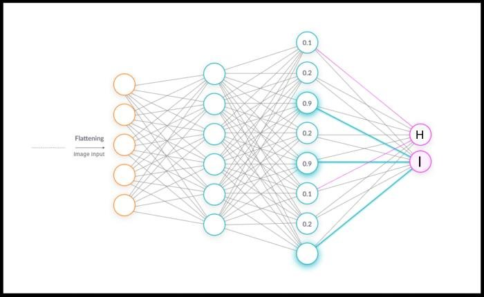
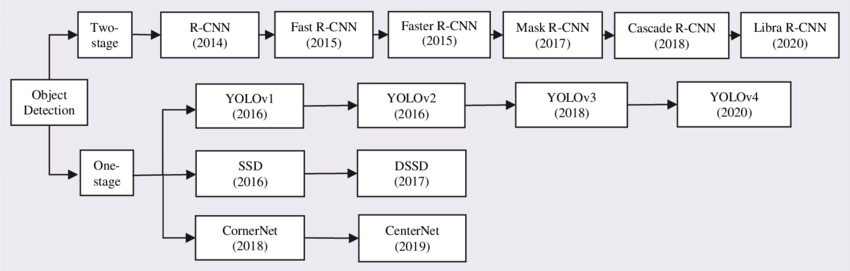
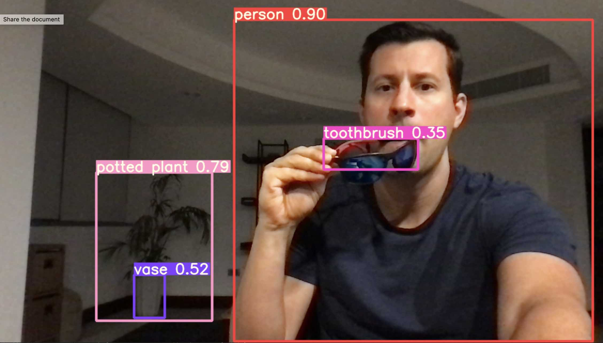

# Convolutional Neural Networks (CNN)

## Pengantar

Sebelum memulai coba buka [link
ini](https://adamharley.com/nn_vis/cnn/2d.html)

## Apa itu CNN

CNN adalah salah satu algoritma machine learning yang telah sukses
digunakan dalam berbagai aplikasi pemrosesan citra, termasuk
klasifikasi, segmentasi, dan deteksi objek. Mereka memanfaatkan lapisan
konvolusi untuk mengekstraksi fitur-fitur penting dari citra. Arsitektur
CNN dianalogikan dengan pola konektivitas otak manusia. Sama seperti
otak yang terdiri dari miliaran neuron, CNN juga memiliki neuron yang
tersusun dengan cara tertentu. Pada CNN gambar akan di representasikan
ke bentuk maatriks agar bisa di olah oleh program.



## Arsitektur CNN

CNN membagi gambar menjadi beberapa layer yaitu input layer, hidden
layer, dan output layer. Hidden layer terbagi lagi menjadi beberapa
bagian. secara garis besar hidden layer terbagi menjadi tiga yaitu
konvolusi, pooling dan fully connected.


### Layer Konvolusi

Lapisan ini merupakan lapisan pertama yang digunakan untuk mengekstrak
berbagai fitur dari gambar masukan. Pada lapisan ini, operasi matematis
konvolusi dilakukan antara matriks gambar masukan dan matriks filter
dengan ukuran MxM tertentu. Dengan menggeser filter ke atas gambar
masukan, perkalian titik antara filter dan bagian gambar masukan diambil
sesuai dengan ukuran filter (MxM). Operasi ini akan dilakuakn dengan
beberapa filter sehingga menghasilkan beberapa output.  
  
Outputnya disebut sebagai peta Fitur yang memberi kita informasi tentang
gambar seperti sudut dan tepinya. Nantinya, peta fitur ini diumpankan ke
lapisan lain untuk mempelajari beberapa fitur lain dari gambar masukan.

### Layer Poooling

Ouput dari covolution akan diteruskan ke Lapisan Penggabungan atau layer
pooling. Tujuan utama dari lapisan ini adalah untuk memperkecil ukuran
peta fitur yang dikonvolusi untuk mengurangi biaya komputasi. Hal ini
dilakukan dengan mengurangi koneksi antar lapisan dan beroperasi secara
independen pada setiap peta fitur. Terdapat dua jenis operasi Pooling
yaitu Max dan Min

Pada Max Pooling, elemen terbesar diambil dari peta fitur. Average
Pooling menghitung rata-rata elemen dalam bagian Gambar berukuran yang
telah ditentukan. Pooling Layer biasanya berfungsi sebagai jembatan
antara Convolutional Layer dan FC Layer.



### Layer Fully Connected (FC)

Lapisan Fully Connected (FC) adalah lapisan inti dari CNN, lapisan ini
adalah lapisan yanga mengaplikasikan algortitma neural network
konvesional. Setelah input gambar di konvolusi dan di pooling beberapa
kali, akan dihasikan beberaba matriks gambar yang ukuran piksel nya
kecil dan berisi informasi penting dari gambar input. Misalkan matriks
yang dihasilkan berjumlah 16 dan setiap matriks berukuran 5x5, maka
total piksel yang dihasilkan adalah 16x5x5 = 400 dan juga terdapat 400
angka yang merepresentasikan warna untuk setiap piksel.

Dalam lapisan ini semua nilai tersebut akan dimasukkan ke beberapa
fungsi dan setiap dari fungsi tersebut memiliki parameter-paramter yang
disebut weight. hasil dari setiap fungsi akan bernilai dari 0 hingga 1
dan nilai ini merepresentasikan tingkat keakurasian suatu fitur berada
dalam gambar.

  
Misal fungsi pertama adaalah untuk mengukur tingkat keakurasian fitur
berupa adanya lingkaran dalam gambar, fungsi kedua mengukur tingkat
keakurasian fitur berupa adanya garis dengan kemiringan sekian, dan
seterusnya. weight dari setiap fungsi dan jumlah fungsi, tergantung pada
apa yang ingin di deteksi. Biasanya nilai weight pada fungsi dan jumlah
fungsi didapat dari trainning data

lapisan ini akan diulang berkali kali dari yang awalnya mengecek
fitur-fitur kecil, lalu output nilai nya dimasukan lagi ke fungsi-fungsi
untuk mendeteksi fitur-fitur yang lebih besar hilngga menghasilkan
output berupa hasil deteksi.

untuk penjelasan lebih lanjut tentang neural network silakah clik [link
ini](https://www.youtube.com/watch?v=aircAruvnKk)  


# YOLO (You Only Look Once)

## Apa itu YOLO ?

Object detection merupakan bagian dari computer vision yang
mengidentifikasi dan lokalisasi objek di dalam gambar atau video. object
detection terbagi menjadi dua yaitu single-shot dan double-shot.
double-shot adalah jenis object detection yang algoritmanya terbagi
menjadi dua tahap Tahap pertama adalah proposisi daerah (region
proposal) yang bertujuan untuk mengidentifikasi daerah-daerah yang
kemungkinan mengandung objek. Tahap kedua adalah deteksi objek yang
sesungguhnya, contohnya adalah algoritma Faster R-CNN. Sedangkan
single-shot mendeteksi objek dalam satu langkah. Artinya, mereka secara
langsung menghasilkan kotak pembatas (bounding boxes) dan label untuk
objek dalam gambar tanpa langkah proposisi daerah terlebih dahulu,
contohnya adalah algoritma YOLO. Single-shot maupun double-shot
mengimplementasikan algortima CNN dalam algoritma mereka.  
  

## Coba YOLO

Berikut adalah step-step untuk implementasi YOLOv5 dan YOLOv8:

### YOLOv5

1.  pastikan sudah memiliki akun github jika belum click
    [disini](https://github.com/join)

2.  pastikan sudah install git lokal. untuk cek instalasi git buka command prompt dan jalankan command berikut 

    ``` bash
    git --version
        
    ```
    jika sudah terinstall akan muncul versi git yang terinstall
    ``` bash
    git version 2.36.1.windows.1

    ```
    jika belum menginstall, ikuti step pada [link ini](https://git-scm.com/book/en/v2/Getting-Started-Installing-Git) untuk instalasi git. lalu cek kempali dengan command diatas
3.  buka command prompt dan pindah ke folder yang diinginkan untuk menyimpan project yolov5 dengan command berikut

    ``` bash
    cd <path_folder>
    ```
    contoh
    ``` bash
    cd Documents/ProjectYolov5
    ```
4.  clone project yolov5 dengan command berikut

    ``` bash
    git clone https://github.com/ultralytics/yolov5
    ```
5. setelah clone selesai akan muncul folde baru dengan nama yolov5. masuk ke folder tersebut dengan command berikut

    ``` bash
    cd yolov5
    ```
6.  install requirements dengan command berikut

    ``` bash
    pip install -r requirements.txt 
    ```
    jika error dikarenakan belum menginstall pip ikuti intruksi pada [link ini](https://pip.pypa.io/en/stable/installation/) untun instalasi pip. lalu jalankan kembali command diatas

7. lalu pada folder yolov5 jalankan command ini untuk me-run algortima yolo dengan webcam
    ```bash
    python3 detect.py --weights yolov5s.pt --source 0
    ```

    setelah di-run maka akan muncul seperti ini
    

### YOLOv8

1. pastikan sudah melakuka instalasi pip
2. install library opencv, supervision, dan ultralytics dengan command berikut

    ``` bash
    pip install opencv-python
    pip install supervision
    pip install ultralytics
    ```
3. buat file python dan copy kode berikut

    ``` python
    import cv2
    import time

    from ultralytics import YOLO
    import supervision as sv

    def main():

        # used to record the time when we processed last frame
        prev_frame_time = 0
    
        # used to record the time at which we processed current frame
        new_frame_time = 0

        cap = cv2.VideoCapture(0)

        model = YOLO("yolov8n.pt")

        box_annotator = sv.BoxAnnotator(
            thickness=2,
            text_thickness=2,
            text_scale=1
        )


        while True:
            ret, frame = cap.read()

            result = model(frame)[0]
            detections = sv.Detections.from_yolov8(result)
            labels = [
                f"{model.model.names[class_id]} {confidence:0.2f}"
                for _, confidence, class_id, _
                in detections
            ]
            frame = box_annotator.annotate(
                scene=frame, 
                detections=detections, 
                labels=labels
            )

            print(labels)

            # font which we will be using to display FPS
            font = cv2.FONT_HERSHEY_SIMPLEX

            # time when we finish processing for this frame
            new_frame_time = time.time()

            # Calculating the fps
    
            # fps will be number of frame processed in given time frame
            # since their will be most of time error of 0.001 second
            # we will be subtracting it to get more accurate result
            fps = 1/(new_frame_time-prev_frame_time)
            prev_frame_time = new_frame_time
        
            # converting the fps into integer
            fps = int(fps)
        
            # converting the fps to string so that we can display it on frame
            # by using putText function
            fps = str(fps)
        
            # putting the FPS count on the frame
            cv2.putText(frame, fps, (7, 70), font, 3, (100, 255, 0), 3, cv2.LINE_AA)

            frame_height, frame_width, _ = frame.shape
            frame = cv2.resize(frame, (int(frame_width*2), int(frame_height*2)))

            cv2.imshow("yolov8", frame)

            if (cv2.waitKey(30) == 27):
                break


    if __name__ == "__main__":
        main()
    ```
4. run kode-nya dengan command 
    ```bash
    python3 <nama_file>
    ```

## Membuat custom dataset dengan roboflow

dua contoh diatas menggunakan dataset yang telah disediakan oleh yolo. Untuk mendeteksi objek-objek yang kita inginkan, kita perlu membuat dataset sendiri. 

1. ambil sample berupa video atau gambar dari objek yang inging kita deteksi
2. buka web roboflow dan upload video atau gambar tersebut 
3. Simak video berikut untuk step selanjutnya
    - https://www.youtube.com/watch?v=wuZtUMEiKWY&t=5s
    - https://www.youtube.com/watch?v=x0ThXHbtqCQ
4. setelah data di-trainning download file dengan format .pt hasil trainning dataset
5. untuk yolov8, ganti path dan nama pada kode yolo berikut ke path dimana file .pt kalian berada
    ```python
    model = YOLO("<path__file.pt>")
    ```
    lalu run kodenya
6. untuk yolov5, masukkan file .pt ke folder yolov5 dan run dengan dengan command berikut
    ``````bash
    python3 detect.py --weights <path_file.pt> --source 0
    ``````